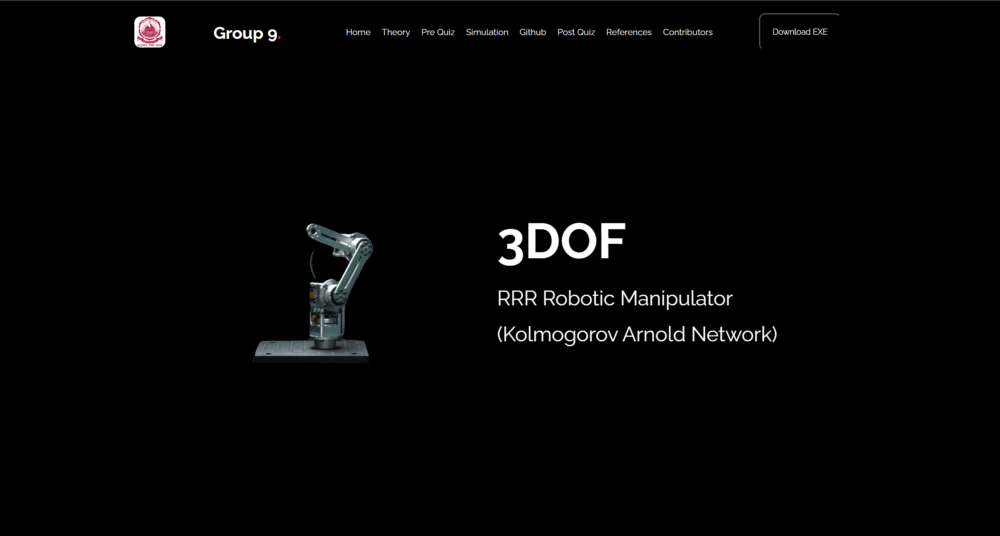
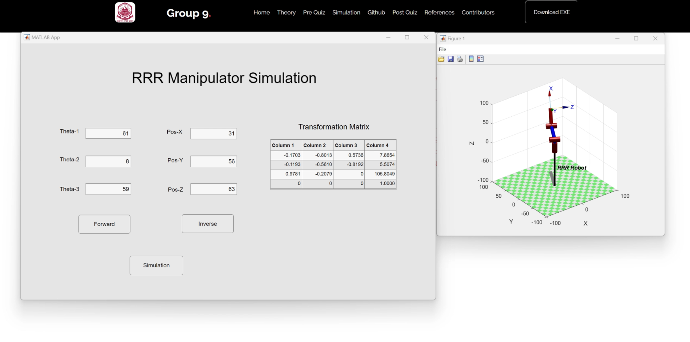

# Website Simulation for 3 DOF Articulated RRR Manipulator

This image provides a preview of our 3 DOF articulated RRR manipulator website. The interface is designed for intuitive interaction and real-time updates using HTML, CSS, and JavaScript.

## Simulation Demonstration in Website
Below is an image preview of the simulation:

And here is the video demonstrates the real-time simulation of our 3 DOF articulated RRR manipulator in our website. Watch how the manipulator responds to user inputs and visualizes the kinematic modeling:

[Video Demonstration of the 3 DOF Manipulator](./pvideo.mp4)

## Features

- **Home**: 
  - Introduction to our 3 DOF articulated RRR manipulator and its applications.

- **Theory**: 
  - Detailed explanation of the kinematic modeling and mathematical background.

- **Pre Quiz**: 
  - A set of questions to test your initial understanding of the concepts.

- **Simulation**: 
  - Interactive 3D model of the manipulator with real-time control and visualization.

- **GitHub**: 
  - Link to our project's GitHub repository containing the source code and documentation.

- **Post Quiz**: 
  - A follow-up quiz to assess your understanding after exploring the simulation.

- **References**: 
  - List of all academic papers, books, and resources we referenced in the project.

- **Contributors**: 
  - Information about our team members who contributed to the project.
